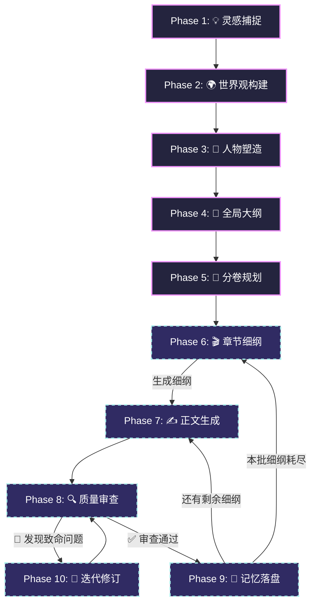
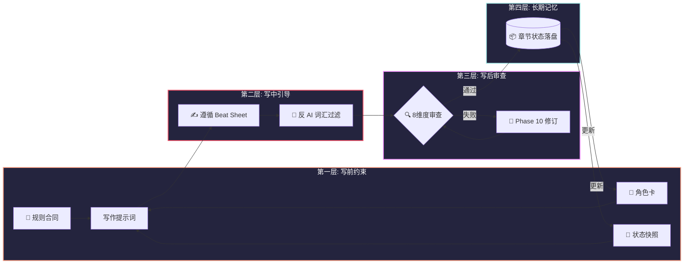
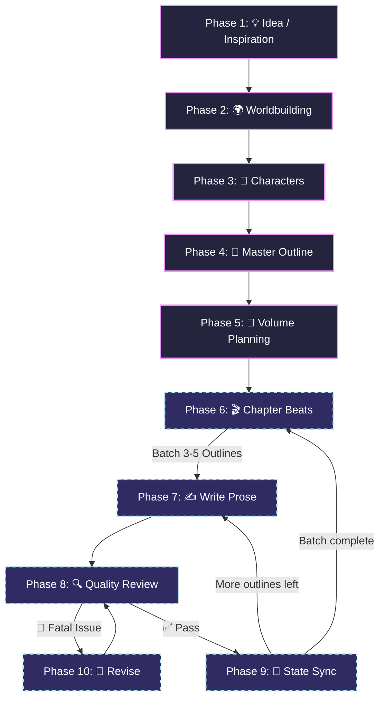
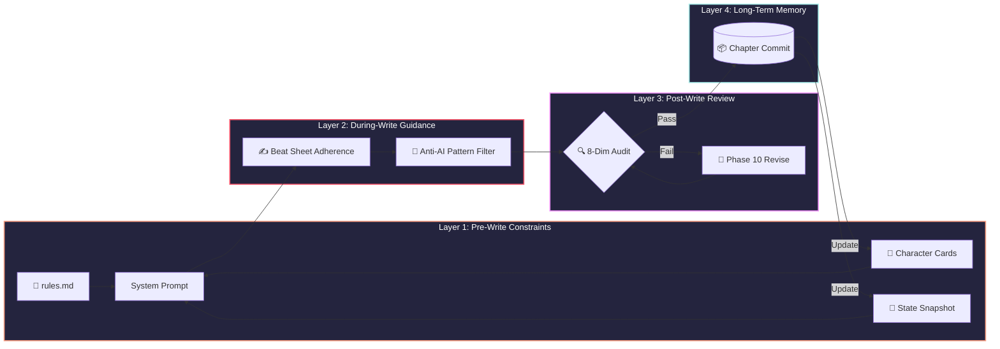

<p align="center">
  
</p>

<h1 align="center">📖 Web Novel Writing Skill</h1>

<p align="center">
  <strong>AI 驱动的中文网络小说创作技能框架</strong>
  <br/>
  <strong>AI-Powered Chinese Web Novel Writing Skill</strong>
</p>

<p align="center">
  <a href="#english-documentation">🇺🇸 English</a> | <a href="#中文文档">🇨🇳 简体中文</a>
</p>

<p align="center">
  <a href="#-快速开始"></a>
  <a href="#-工作流概览"></a>
  <a href="#-部署到ai助手"></a>
</p>

<p align="center">
  
  
  
  
  
  
</p>

---

<h1 align="center" id="中文文档">🇨🇳 中文文档</h1>

> **将你的 AI 编程助手变成专业的中文网络小说写作搭档**
>
> **Web Novel Writing Skill** 不是一个简单的提示词（Prompt），而是一套完整的 **AI 辅助长篇网络小说创作技能框架**。它通过 **10 阶段流水线**、**7 种专家角色**、**4 层防幻觉机制** 和 **题材专属模板**，将任何 AI 编程助手变成你的网文创作搭档。

## 📖 项目简介

### 核心解决的问题

| 痛点 | 解决方案 |
|:---|:---|
| AI 写着写着忘了前面的剧情 | 4 层记忆系统 + "章节提交" 机制 |
| 人物性格前后不一致 | 五维性格 DNA + 行为红线机制 |
| AI 写出来的文字一股"AI味" | 全面的反 AI 痕迹规则库 |
| 后期节奏越写越乱 | 3:1 节奏法则 + 情绪曲线设计 |
| 剧情逻辑 Bug 频出 | 每章 8 维度质量审查 |
| 伏笔埋了就忘 | 专属伏笔追踪器 + 超期提醒 |
| 开篇留不住读者 | 黄金三章策略 |
| 不同题材缺乏针对性 | 玄幻/都市/言情/科幻 专属指南 |

---

## 🚀 快速开始

### 第一步：克隆仓库

```bash
git clone https://github.com/XINGANLIU/web-novel-writing-skill.git
```

### 第二步：部署到你的 AI 助手

#### Claude Code 部署

```bash
cd 你的小说项目目录
git clone https://github.com/XINGANLIU/web-novel-writing-skill.git .novelforge
cp .novelforge/CLAUDE.md ./CLAUDE.md
```

#### Cursor 部署

```bash
cd 你的小说项目目录
git clone https://github.com/XINGANLIU/web-novel-writing-skill.git .novelforge
cp .novelforge/.cursorrules ./.cursorrules
```

#### Codex CLI 部署

```bash
cd 你的小说项目目录
git clone https://github.com/XINGANLIU/web-novel-writing-skill.git .novelforge
cp .novelforge/AGENTS.md ./AGENTS.md
```

#### Gemini Code Assist 部署

```bash
cp -r web-novel-writing-skill ~/.gemini/config/plugins/web-novel-writing-skill-plugin
```

### 第三步：开始创作！

在 AI 助手中输入：

```
/novel-new 我想写一本赛博朋克修仙小说，主角是一个在虚拟世界中觉醒了真气的程序员
```

AI 将自动进入 Phase 1（灵感捕捉），引导你一步步完成整个创作流程。

---

## 🎯 工作流概览



**核心原则**：
1. **阶段推进，不跳步** — 每个阶段必须经过用户确认才能进入下一阶段
2. **大纲即法律** — `rules.md` 中的规则是 AI 写作时不可违背的"合同"
3. **一次一章** — 正文生成每次只写一章，避免上下文溢出
4. **写后必审** — 每章生成后自动进行 8 维度质量审查
5. **审后必存** — 审查通过后自动更新全局状态和角色卡

---

## 🛡️ 四层防幻觉机制

这是本框架的核心创新——四道防线确保 AI 不会"胡编乱造"：

**第一层：写前约束**
- "合同系统"：`rules.md` 明确定义了世界观中"什么是不可能的"
- 强制上下文注入：写作前必须读取角色卡、前章状态、伏笔表

**第二层：写中引导**
- Beat Sheet 贴合：严格按照章节细纲的节拍点写作
- 反 AI 模式清单：禁用"不禁"、"竟然"、"一股力量涌上心头"等 AI 典型用语

**第三层：写后审查**
- 8 维度质量评分：设定一致性🔴 人物一致性🔴 时间线🟠 伏笔🟠 节奏🟡 文笔🟡 密度🟢 钩子🟢
- 致命问题自动阻断：发现 🔴 级问题时禁止继续写下一章

**第四层：长期记忆**
- "章节提交"：每完成一章后提取状态变更，更新到全局快照
- 角色卡热更新：角色的实力、关系、物品等信息实时更新



---

## 📚 支持的题材

| 题材 | 文件 | 覆盖内容 |
|:---|:---|:---|
| ⚔️ 玄幻/修仙 | `genre-guides/xuanhuan.md` | 修炼体系、境界划分、宗门体系、经典套路、爽点设计 |
| 🏙️ 都市 | `genre-guides/urban.md` | 异能/商战/医术、身份揭露、财富碾压、多线交织 |
| 💕 言情 | `genre-guides/romance.md` | 情感曲线、人设互补、甜虐节奏、经典桥段 |
| 🚀 科幻 | `genre-guides/scifi.md` | 科技树、文明等级、星际政治、硬核设定展示 |

---

<br/>
<br/>
<br/>

<h1 align="center" id="english-documentation">🇺🇸 English Documentation</h1>

> **Transform your AI coding assistant into a professional Chinese web novel co-author.**
>
> Web Novel Writing Skill is not just a prompt — it's a complete **10-phase pipeline** with **7 expert agents**, **4 anti-hallucination safeguards**, and **genre-specific templates** that turns any AI coding agent into a world-class web novel writing partner.

---

## ✨ Features

### 🏗️ 10-Phase Writing Pipeline

A structured workflow that guides you from initial spark to polished chapter:



| Phase | Name | What It Does |
|:---:|:---|:---|
| 1 | **Inspiration Capture** | Genre positioning, market analysis, core selling point extraction |
| 2 | **Worldbuilding Workshop** | Power systems, geography, factions, hard rules ("Contract System") |
| 3 | **Character Forge** | 5D personality DNA, behavior red lines, relationship networks |
| 4 | **Master Outline** | Story skeleton, emotion curves, foreshadow layout |
| 5 | **Volume Planning** | Pacing design (3:1 rule), Golden Three Chapters strategy |
| 6 | **Chapter Beats** | Beat sheets, scene design, chapter-end hooks |
| 7 | **Prose Generation** | Style-aware writing with anti-AI-pattern enforcement |
| 8 | **Quality Review** | 8-dimension audit (setting, character, timeline, foreshadow...) |
| 9 | **State Sync** | "Chapter commit" — memory persistence across chapters |
| 10 | **Revision** | Incremental fixes, adversarial editing, version tracking |

### 🎭 7 Expert Agent Roles

The AI seamlessly switches between specialized roles:

| Agent | Role | Phases |
|:---:|:---|:---:|
| 🌍 | **Worldbuilder Architect** — Designs worlds, defines laws | 1-2 |
| 👤 | **Character Psychologist** — Creates living, consistent characters | 3 |
| 📐 | **Structure Engineer** — Plans story arcs, controls pacing | 4-5 |
| 🎭 | **Plot Playwright** — Crafts scene-by-scene beat sheets | 6 |
| ✍️ | **Literary Renderer** — Writes vivid, web-novel-style prose | 7, 10 |
| 🔍 | **Quality Inspector** — 8-dimension quality audit | 8 |
| 🧠 | **Memory Keeper** — Manages state, tracks foreshadowing | 9 |

### 🛡️ 4-Layer Anti-Hallucination Shield

The core innovation that prevents AI from "going off-script" in long-form fiction:



### 📚 Genre Templates

Built-in guides for the most popular Chinese web novel genres:

| Genre | Key Elements |
|:---|:---|
| ⚔️ **Xuanhuan / Xianxia** | Cultivation systems, sect hierarchies, power breakthroughs |
| 🏙️ **Urban Fantasy** | Hidden powers in modern world, identity reveals, wealth |
| 💕 **Romance** | Emotional arcs, relationship tension curves, sweet moments |
| 🚀 **Sci-Fi** | Tech trees, civilization tiers, cosmic exploration |

---

## 🚀 Quick Start

### Prerequisites

- An AI coding agent (Claude Code, Cursor, Codex, or Gemini Code Assist)
- A workspace/project directory for your novel

### Step 1: Clone the Repository

```bash
git clone https://github.com/XINGANLIU/web-novel-writing-skill.git
```

### Step 2: Deploy to Your AI Agent

Choose your agent and follow the instructions below in the **Deployment** section.

### Step 3: Start Writing!

Open your AI agent and type:

```
/novel-new 我想写一本赛博朋克修仙小说
```

The AI will guide you through the entire pipeline, starting from Phase 1.

---

## 📦 Deployment

###  Claude Code

Claude Code uses a `CLAUDE.md` file in the project root for custom instructions.

**Option A: Direct Use (Recommended)**
```bash
# Clone into your novel project directory
cd your-novel-project
git clone https://github.com/XINGANLIU/web-novel-writing-skill.git .novelforge
# Copy the Claude Code adapter
cp .novelforge/CLAUDE.md ./CLAUDE.md
```

**Option B: Global Installation**
```bash
# Copy to your home directory for global access
cp CLAUDE.md ~/.claude/CLAUDE.md
```

Then open Claude Code in your project directory and start with `/novel-new`.

---

###  Cursor

Cursor uses `.cursorrules` or `.cursor/rules/` for project-level instructions.

**Option A: Single Rules File**
```bash
cd your-novel-project
git clone https://github.com/XINGANLIU/web-novel-writing-skill.git .novelforge
# Copy the Cursor adapter
cp .novelforge/.cursorrules ./.cursorrules
```

**Option B: Rules Directory (Cursor 0.45+)**
```bash
mkdir -p .cursor/rules
cp .novelforge/.cursor/rules/novelforge.mdc .cursor/rules/
```

Restart Cursor, and the skill is automatically loaded.

---

###  OpenAI Codex CLI

Codex uses `AGENTS.md` for agent instructions.

```bash
cd your-novel-project
git clone https://github.com/XINGANLIU/web-novel-writing-skill.git .novelforge
# Copy the Codex adapter
cp .novelforge/AGENTS.md ./AGENTS.md
```

Then run:
```bash
codex "开始创建一本新的网络小说"
```

---

###  Gemini Code Assist (Antigravity)

Gemini uses a plugin/skill structure.

**Method: Install as Plugin**

1. Copy the entire directory to your Gemini plugins folder:
```bash
cp -r web-novel-writing-skill ~/.gemini/config/plugins/web-novel-writing-skill-plugin
```

2. Ensure the directory structure matches:
```
~/.gemini/config/plugins/web-novel-writing-skill-plugin/
├── plugin.json
└── skills/
    ├── SKILL.md
    └── references/
        └── ...
```

3. Restart Gemini Code Assist. The skill will appear as available.

---

## 📂 Project Structure

```
web-novel-writing-skill/
├── README.md                     # This file (bilingual)
├── LICENSE                       # MIT License
├── SKILL.md                      # 🎯 Main skill entry point
├── CLAUDE.md                     # Claude Code adapter
├── AGENTS.md                     # Codex adapter
├── .cursorrules                  # Cursor adapter
├── assets/
│   └── banner.svg                # Project banner
└── references/
    ├── phases/                   # 10 pipeline phase instructions
    ├── agents/                   # 7 expert agent definitions
    ├── templates/                # Fill-in templates
    ├── quality-gates/            # Quality assurance
    └── genre-guides/             # Genre-specific guides
```

---

## 🎮 Commands

| Command | Description |
|:---|:---|
| `/novel-new` | Start a new novel project (Phase 1) |
| `/novel-world` | Enter/edit worldbuilding (Phase 2) |
| `/novel-characters` | Enter/edit character design (Phase 3) |
| `/novel-outline` | Edit master outline (Phase 4) |
| `/novel-volume [N]` | Plan volume N (Phase 5) |
| `/novel-plan [N]` | Generate outlines for next N chapters (Phase 6) |
| `/novel-write [N]` | Write chapter N (Phase 7) |
| `/novel-review [N]` | Review chapter N quality (Phase 8) |
| `/novel-revise [N]` | Revise chapter N (Phase 10) |
| `/novel-resume` | Resume writing after a break (cold start recovery) |
| `/novel-status` | View global state snapshot |
| `/novel-dashboard` | Project overview (progress, stats, foreshadows) |
| `/novel-foreshadow` | View all foreshadow status |
| `/novel-character [name]` | View/update a character's status |

---

## 🤝 Contributing

Contributions are welcome! Here are some ways you can help:

- 🐛 **Bug Reports** — Found an issue with a template or instruction? Open an issue!
- 📝 **New Genre Guides** — Write a guide for a genre not yet covered
- 🌍 **Translations** — Help translate templates to other languages
- 🔧 **Agent Adapters** — Add support for more AI coding agents
- 💡 **Improvements** — Better prompts, new quality checks, refined templates

Please read [CONTRIBUTING.md](CONTRIBUTING.md) before submitting a PR.

---

## 📜 License

This project is licensed under the MIT License — see the [LICENSE](LICENSE) file for details.
